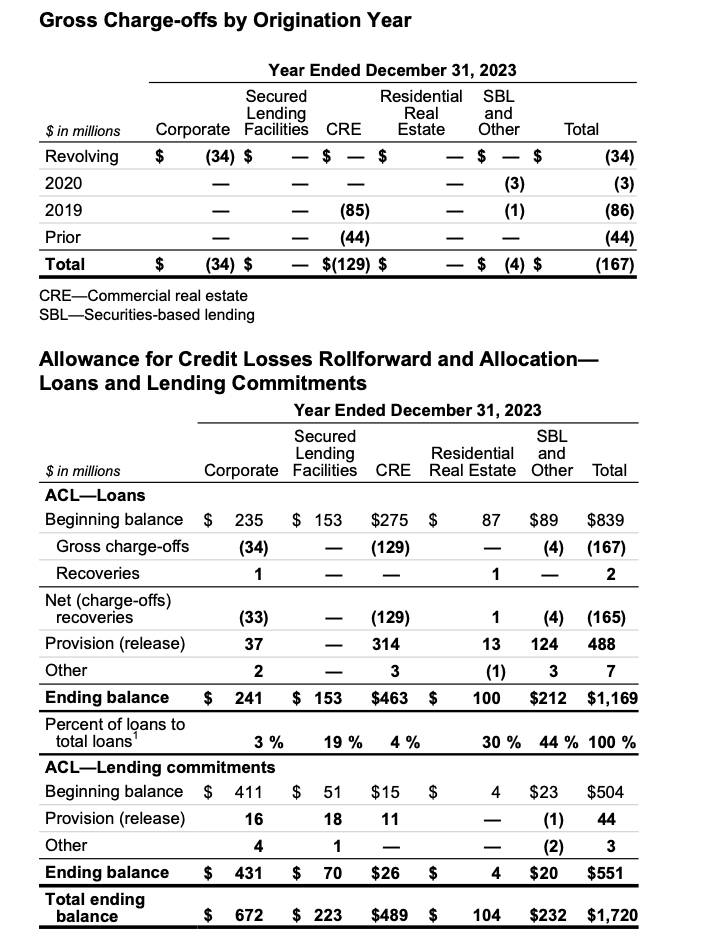
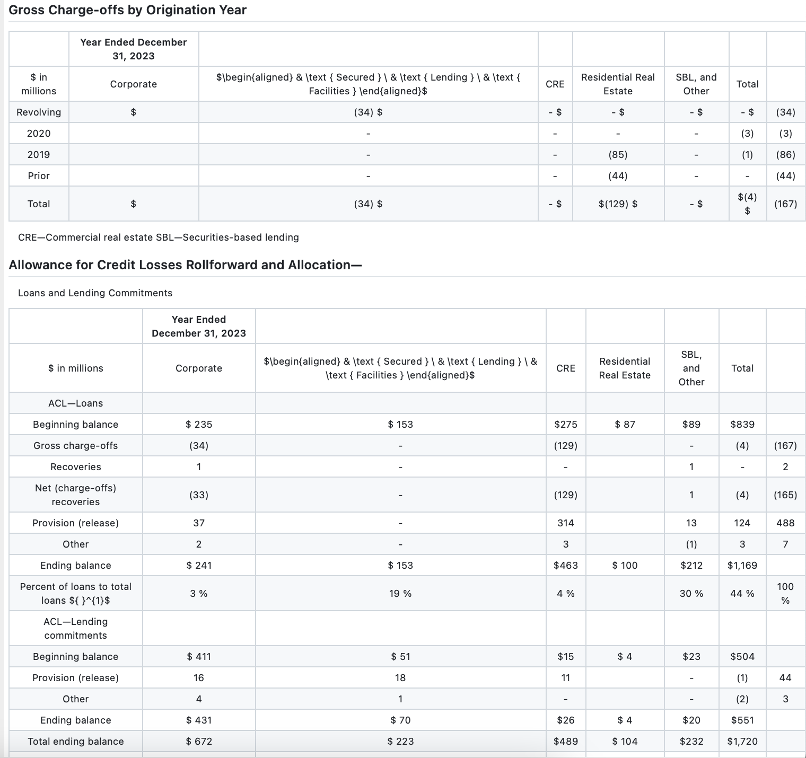
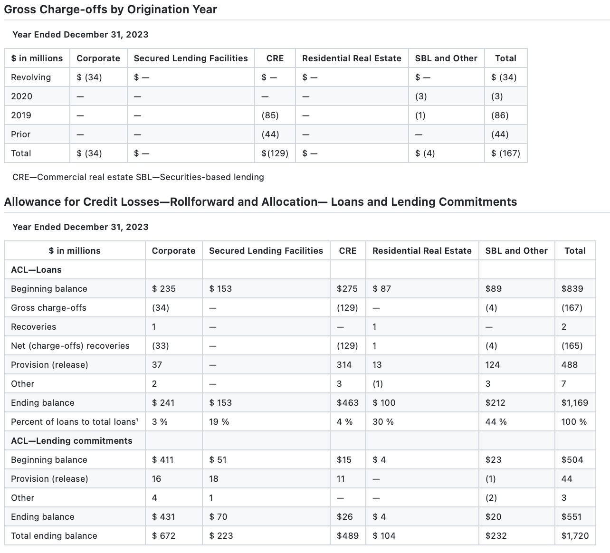
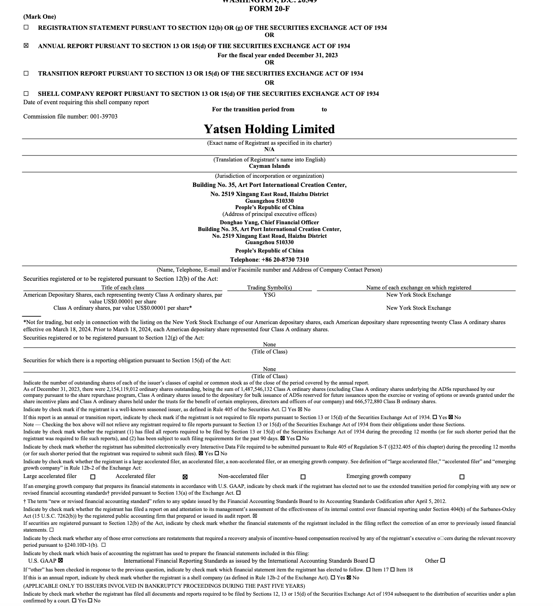
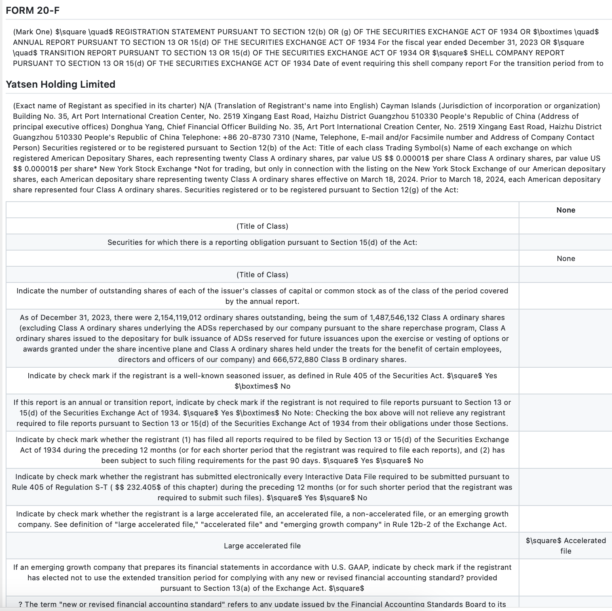
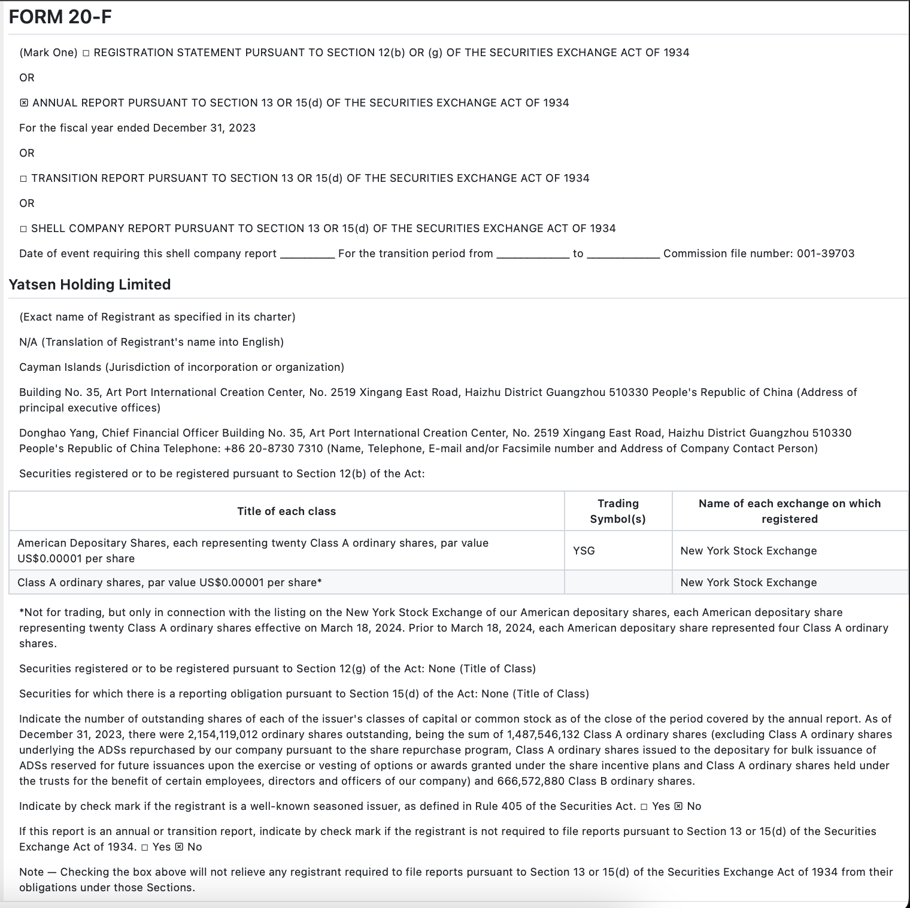

> pulseai 针对 mistral ocr 做了个测试，发现这个“世界最强 OCR”虽然效果还不错，但不至于哪都能打，吹嘘有点过了。
> 
> 如果使用 VL 模型来做OCR的任务，会面临当前这些问题：
> 
> 图像方面模糊以及角度、各种少见字、偏僻字、符号等等的处理
> 结构化数据保留：vl 模型没法给出版面信息的表达
> 确定性结果：企业工作流需要一致、可复现的输出，而 VLM（如 Mistral）即使> 在相同输入下也可能产生不同的结果。就是有幻觉，这是致命的！
>
> 以下是翻译的全文内容，值得参考！！！

超越炒作：Mistral OCR 的真实世界测试
Mistral AI 推出了他们所谓的“全球最佳 OCR（光学字符识别）模型”。作为该领域的开发者，我们决定在复杂的嵌套表格、饼图等方面对其进行测试，以查看 VLM（视觉语言模型）是否仍然存在幻觉问题，以及问题的严重程度。虽然结果比 Gemini 2.0 Flash 更有希望，但我们在多个文档领域发现了一些关键性失败点。以下是一些示例：

财务文档
Mistral 的 OCR 在包含嵌套小计和层次关系的多列财务报表中表现不佳。我们观察到以下问题：

• 复杂表格的列对齐错误率达 17%

• 数值精度下降（平均偏差 ±1.5%）

• 负值的括号表示丢失（这对财务分析至关重要）

（标准数据，来源：摩根士丹利）

（Mistral OCR 输出）

通过将 Mistral OCR 输出与标准数据进行对比，可以明显看出 VLM 在表格结构提取方面的失败之处。列错位，并且两个表格都多出了一个额外的列，其中包含随机分布的数值。此外，模型未能识别“$”字符的不规则间距，导致行被错误拆分。

（Pulse API 输出）

相比之下，Pulse 的模型专门针对财务文档的表格结构进行训练（这是我们迄今为止最大的应用场景！），结果显示两张表的识别准确率接近 100%。对于希望用 OCR 取代人工数据录入的客户来说，准确捕获正确的表格结构至关重要。

法律文档
对于法律合同和合规表格，Mistral OCR 也存在以下问题：

• 在密集问卷和 10-K 财报文件中，复选框检测几乎完全缺失

• 章节层次结构和缩进关系丢失，影响整体结构

• 具有多行内容的表格单元格经常被合并或截断

（标准数据 Form 20-F，来源：SEC）

（Mistral OCR 输出）

在测试多个问卷、清单和法律文件后，我们注意到一个关键失败点——复选框检测。查看输出后发现，该模型错误地将所有内容格式化为表格，未能正确识别哪些复选框被勾选，并且在小字体文本的识别上也出现错误，例如将“filter”误识别为“file”。

（Pulse API 输出）

相比之下，Pulse 的模型成功检测到所有复选框，并在需要时正确地格式化表格，所有标记均正确无误！

企业级 OCR 需求 vs. 消费级 OCR
虽然 Mistral 提供了令人印象深刻的 OCR 基础功能，但企业级文档处理的需求远远超过“一刀切”的通用方案。企业 OCR 处理需要以下关键功能：

领域特定的微调 ：Mistral 不支持针对行业特定文档的定制微调，而这对于专业应用至关重要。
人工审核验证 ：企业级解决方案需要人工审核工作流来验证不确定的提取结果。Pulse 通过可配置的置信度阈值和审核界面支持这一需求。
结构化数据保留 ：除了提取文本，保持文档结构对于后续处理至关重要。Mistral 处理许多表格时仅将其视为普通图像，而不是结构化数据。
确定性结果 ：企业工作流需要一致、可复现的输出，而 VLM（如 Mistral）即使在相同输入下也可能产生不同的结果。
我们对 Mistral 团队在数据摄取管道中引入边界框检测的做法表示认可，我们认为这是正确的方向。我们的初步测试表明，尽管通用 VLM 正在不断进步，但在高精度、结构化数据保留和行业适应性方面，专门的文档处理系统仍然是关键业务应用中不可替代的解决方案。

原文链接：[Pulse AI Blog - Beyond the Hype: Real-World Tests of Mistral's OCR](https://www.runpulse.com/blog/beyond-the-hype-real-world-tests-of-mistrals-ocr)